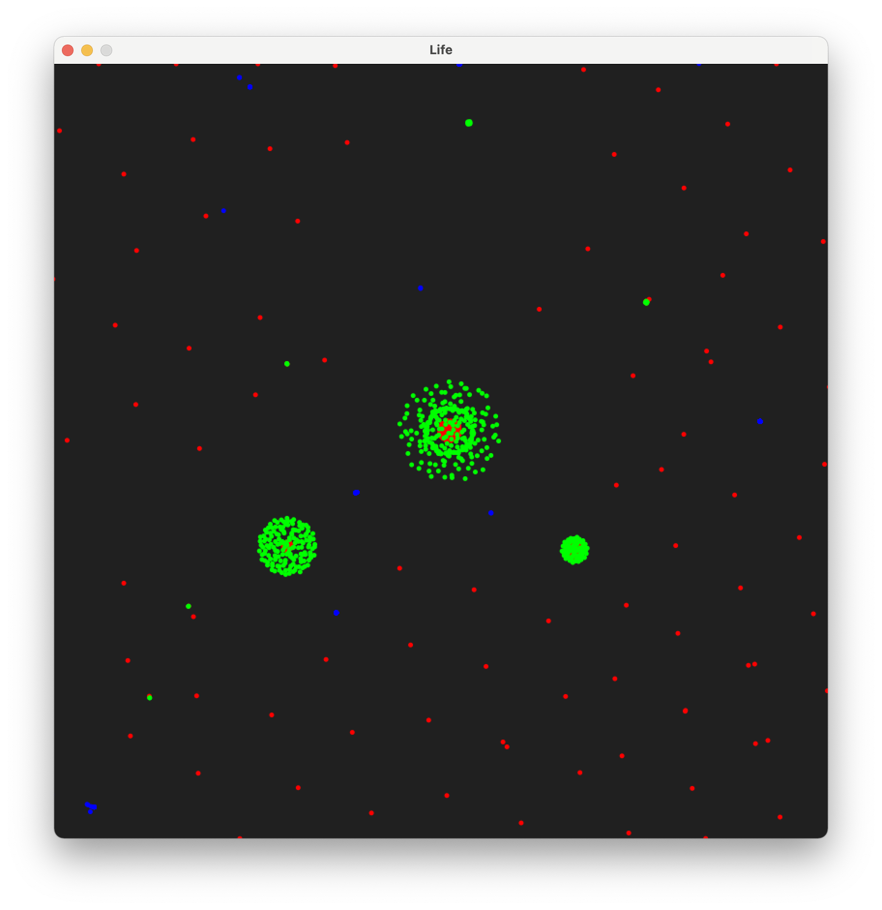
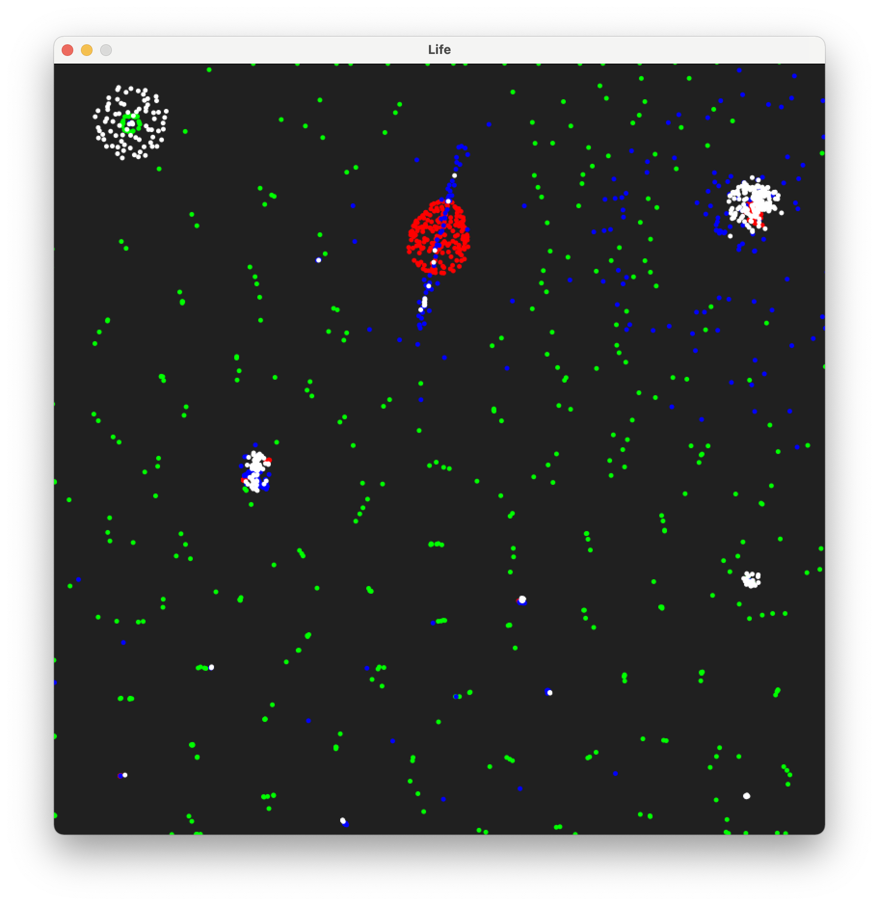
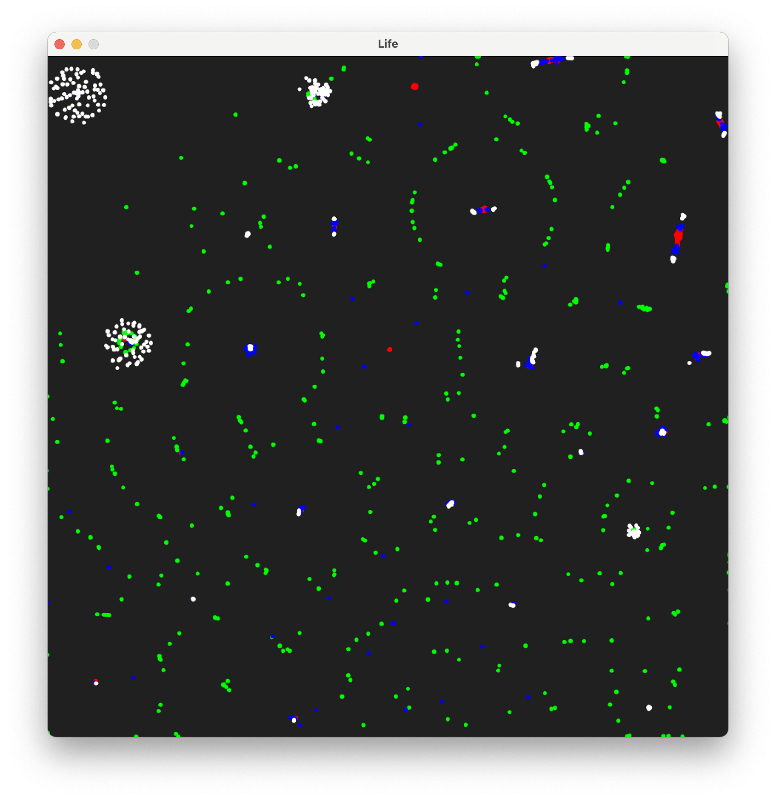

# Life-Particle-Simulation-Hackathon
This is a particle simulation realized in Processing(Java) under a 4-hour time constraint

Credit to Brainxyz for the inspiration and guidance of his video found [here](https://www.youtube.com/watch?v=0Kx4Y9TVMGg&list=PLJ4719mkxmAg438ROtpsuNQJ5CPqe70jx&index=3&t=715s). Much of this project was adapting this to work in Processing, along with some fun individual exploration of values and adding of features.

The entire project, along with pictures and videos, can be found on my [Behance](https://www.behance.net/gallery/183196423/Life-A-Particle-Simulation-Hackathon-Project).

## At a glance
This is a simulation of 3-4 different types of particles interaction based on a simple set of rules. They seem to have emergent properties, exhibiting complex life-like behaviors that change depending on the rules. Below is a screenshot of one of the presets, but I highly encourage you to check out the videos on Behance.

